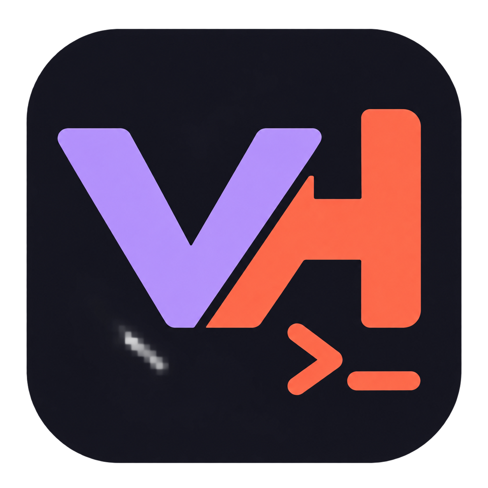

# Vibe Harder



Your agent chats, across your computers. Windows, Linux, macOS, and an Android remote client.

[**Download**](https://github.com/isaiahpettingill/vibe-harder/releases/latest) · [Remote setup](REMOTE.md) · [Build & install](packaging/README.md) · [Usage](USAGE.md)

- **Codex, Claude, OpenCode:** streaming, model controls, queues, and ACP slash commands.
- **Local, WSL, or remote workspaces:** agents stay running on their host when you disconnect.
- **Pair once:** paste a connection code; saved devices reconnect without host access.
- **Tray and recovery:** keep working in the background; choose prompted or automatic resume.
- **Comfortable chat:** collapsible tools, styled copying, resizable panes, themes, and separate fonts.
- **Small native app:** Native AOT on Windows/Linux. No bundled Node.js or browser engine.

### Start

1. Install the package for your platform.
2. Open a local folder, WSL workspace, or [pair a remote computer](REMOTE.md).
3. Configure an installed provider adapter and sign in when prompted.

Provider adapters are separate programs. The default `npx` commands require Node.js in the workspace's environment; Vibe Harder itself and its remote server do not.

### Build

Install the SDK in `global.json`, then:

```sh
dotnet run --project src/CodexManager -p:PublishAot=false
```

[MIT license](LICENSE). App logo: [LOGO.png](LOGO.png).
